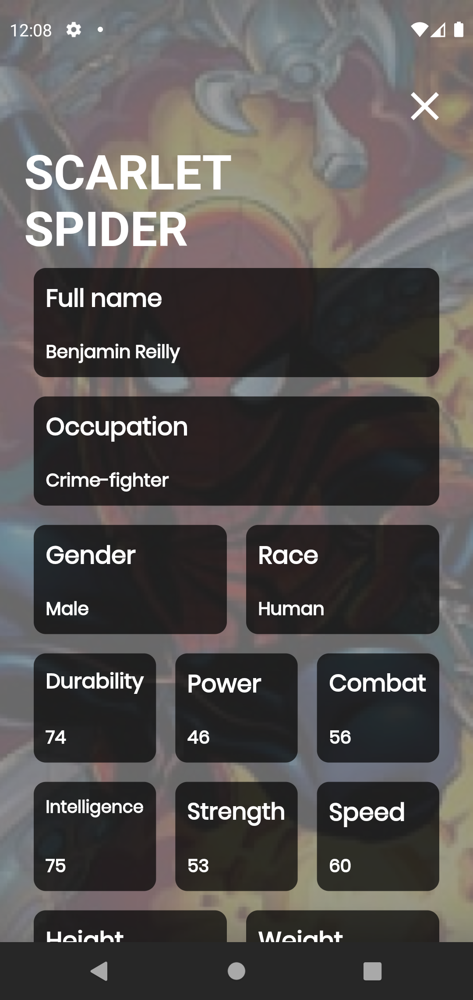

<h1 align="center">
	  
    SuperHero App - SuperHero Api
</h1>

    

        <em>
            Get all SuperHeroes and Villians data from all universes  
        </em>
    
     
    
    
   
     
    
     
     
   
    

## 📌About

This project was created to get data from the [Super Heros Api](https://superheroapi.com/try-now.html)

## 📕Installation

To run this project on your own, do the following: 
1. Clone this project.
2. Run `flutter pub get`.
3. Access to [superheroapi](https://superheroapi.com/try-now.html) and create your own *access-token*
4. Add your personal *access-token* in variable ***key*** at *app/home/data/datasources/endpoints.dart*
5. Run the project using `flutter run` or using your IDE's tools.

## 🌐Technologies and dependencies
- [cached_network_image](https://pub.dev/packages/cached_network_image)
- [google_fonts](https://pub.dev/packages/google_fonts)
- [async](https://pub.dev/packages/async)
- [rxdart](https://pub.dev/packages/rxdart)
- [dartz](https://pub.dev/packages/dartz)
- [dio](https://pub.dev/packages/dio)
- [mockito](https://pub.dev/packages/mockito)
- [flutter_staggered_grid_view](https://pub.dev/packages/flutter_staggered_grid_view)
- [flutter_modular](https://pub.dev/packages/flutter_modular)
- [modular_codegen](https://pub.dev/packages/modular_codegen)
- [flutter_mobx](https://pub.dev/packages/flutter_mobx)
- [mobx](https://pub.dev/packages/mobx)
- [mobx_codegen](https://pub.dev/packages/mobx_codegen)
- [build_runner](https://pub.dev/packages/build_runner)

## 📱 Screenshots
|     |     |     |     |
| :-: | :-: | :-: | :-: |
|  Type a Hero name | Get Heros | Hero Details 
|  |  |  
